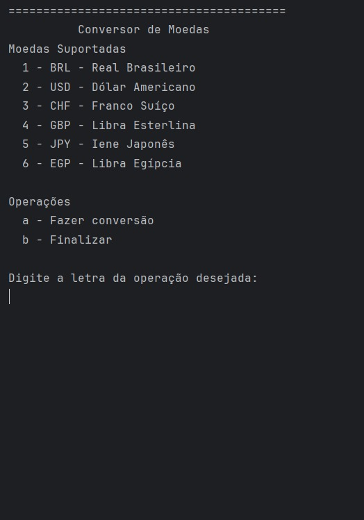
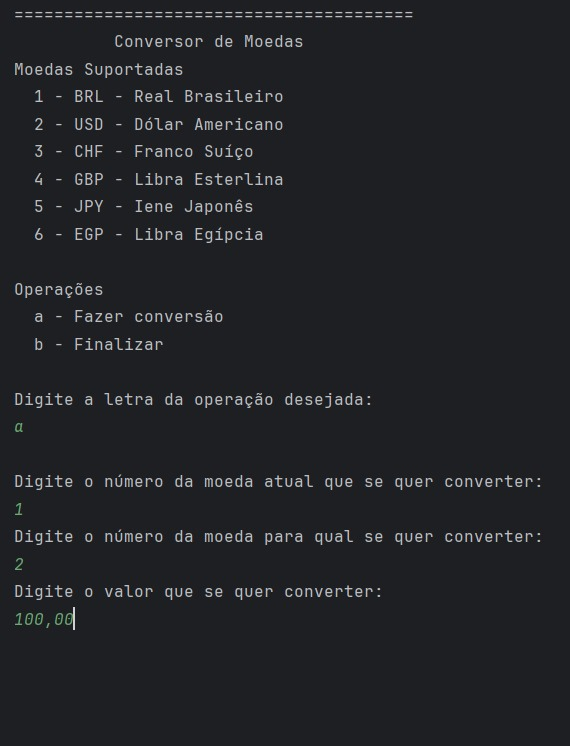
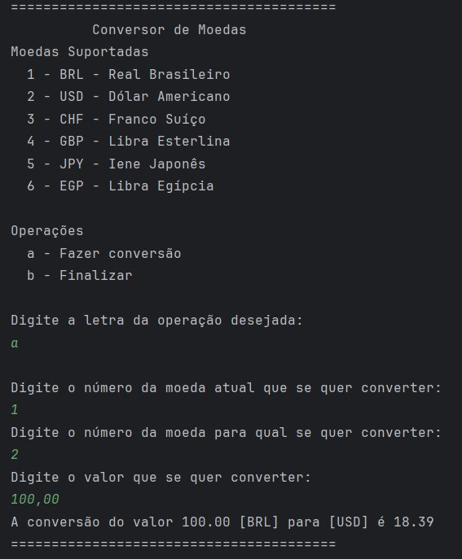
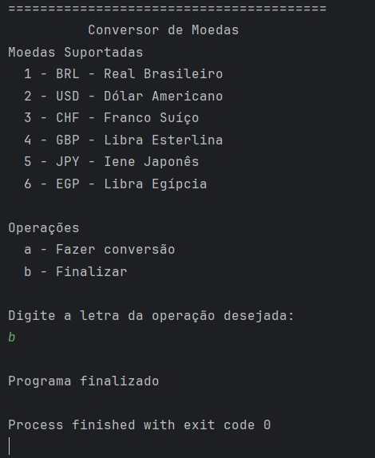

# Conversor de Moedas

💬 Este projeto foi desenvolvido como proposta de conclusão da trilha de *Java e Orientação a Objetos* da **Alura** através do programa **Oracle Next Education**. Trata-se de uma aplicação em Java de um conversor de moedas que faz uso da *ExchangeRate-API*.
---

## Aplicação

> O programa funciona através do terminal, onde, ao executar, irá aparecer um menu.

> Ao digitar a letra 'a' para selecionar a operação de conversão será solicitado o número correspondente a moeda de origem, da moeda final, de acordo com a relação mostrada no início da aplicação e o valor para conversão.

> Uma vez com essas informações a aplicação irá retornar uma string com os dados da conversão e exibir o menu inicial novamente.

> Por fim ao digitar a letra 'b' a aplicação se encerra.

---

## Desenvolvimento

O programa foi desenvolvido visando o uso das boas práticas e as diretrizes da POO. O menu foi feito em loop com o uso do `while`.   
A relaçã
